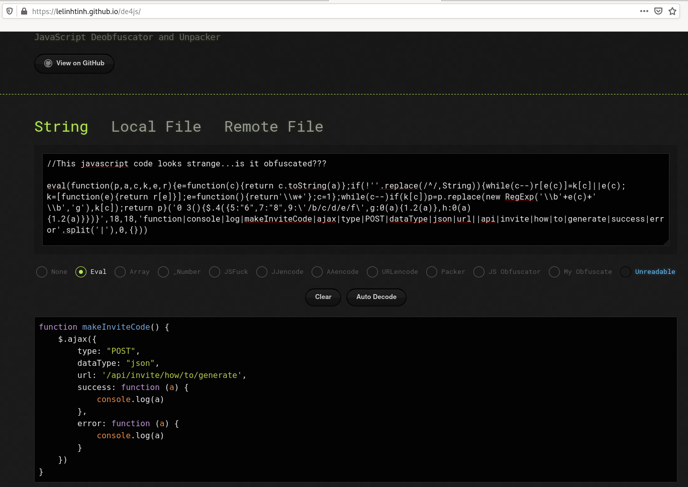

# Invite

## What is it all about?

HackTheBox for Individuals is "a massive playground for you to learn and improve your pen-testing skills". To join, you need an invitation code. And to get this code, you need to solve a challenge.

## Link

Go to https://www.hackthebox.eu/invite. You will get this:


# Challenge

## Source code

First analyze the source code of the page. The `Ctrl+U` is disabled here but you can use the web developer bar (`Ctrl+Shift+I`). Or use `curl` to download the source code.

.

At the end of the page, you'll notice 3 javascripts:

```html
<script src="https://www.hackthebox.eu/js/htb-frontend.min.js"></script>
<script defer src="/js/inviteapi.min.js"></script> <script defer src="https://www.hackthebox.eu/js/calm.js"></script>
<script>function showHint() {
   $("#help_text").show(); }
</script>
```

## Obfuscated javascript

One of them is interesting for our challenge:

~~~
$ curl -s https://www.hackthebox.eu/js/inviteapi.min.js
//This javascript code looks strange...is it obfuscated???

eval(function(p,a,c,k,e,r){e=function(c){return c.toString(a)};if(!''.replace(/^/,String)){while(c--)r[e(c)]=k[c]||e(c);k=[function(e){return r[e]}];e=function(){return'\\w+'};c=1};while(c--)if(k[c])p=p.replace(new RegExp('\\b'+e(c)+'\\b','g'),k[c]);return p}('0 3(){$.4({5:"6",7:"8",9:\'/b/c/d/e/f\',g:0(a){1.2(a)},h:0(a){1.2(a)}})}',18,18,'function|console|log|makeInviteCode|ajax|type|POST|dataType|json|url||api|invite|how|to|generate|success|error'.split('|'),0,{}))
~~~

This is an obfuscated script. Deobfuscate it using this website: https://lelinhtinh.github.io/de4js/



Here is the deobfuscated script:

```javascript
function makeInviteCode() {
    $.ajax({
        type: "POST",
        dataType: "json",
        url: '/api/invite/how/to/generate',
        success: function (a) {
            console.log(a)
        },
        error: function (a) {
            console.log(a)
        }
    })
}
```

## Call the invitation web service

As you can see, the `makeInviteCode()` function calls a web service and logs the response in the console. Let's call the function from the console directly. Here is the result we get:

~~~
0: 200
​
data: Object { data: "Va beqre gb trarengr gur vaivgr pbqr, znxr n CBFG erdhrfg gb /ncv/vaivgr/trarengr", enctype: "ROT13" }
​
hint: "Data is encrypted … We should probably check the encryption type in order to decrypt it…"
​
success: 1
~~~

The data is encoded in ROT13. You can decode it as follows:

~~~
$ echo "Va beqre gb trarengr gur vaivgr pbqr, znxr n CBFG erdhrfg gb /ncv/vaivgr/trarengr" | tr 'A-Za-z' 'N-ZA-Mn-za-m'
In order to generate the invite code, make a POST request to /api/invite/generate
~~~

We are asked to make a POST request, we can do that with `curl`:

~~~
$ curl -X POST https://www.hackthebox.eu/api/invite/generate
{"success":1,"data":{"code":"RURWREktWUZIRFMtWEZCV0MtRFNIV0MtR0VKWEw=","format":"encoded"},"0":200}
~~~

The invitation link is encoded with base64. Let's decode it:

~~~
$ echo "RURWREktWUZIRFMtWEZCV0MtRFNIV0MtR0VKWEw=" | base64 -d
EDVDI-YFHDS-XFBWC-DSHWC-GEJXL
~~~

Now, enter the invitation link to the invite page (https://www.hackthebox.eu/invite):


Click on the "Register" button and you will be redirected to https://www.hackthebox.eu/register where you will be able to register and start the journey in HTB!
